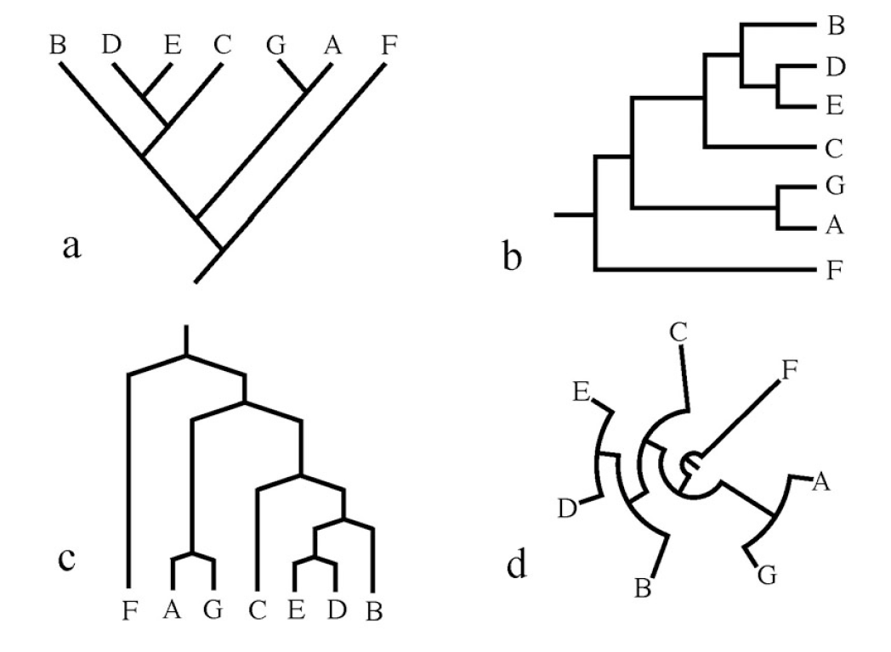

# Linux Basic
___
Linux is a operating system (OS) that many phylogenetic programs use. The Mac OS is Linux based, which means it requires minimal instillation. On the other hand the Windows OS is not, therefore we need to install Linux.  
## Mac Instillation Instructions
1. Look for the Terminal.app using your finder. It should be in the following location: Applications/Utilities/Terminal.app
2. Be moral support for your classmates with Windows because its complicated. 

## Windows Instillation instructions
For Window users we are going to install a Linux virtual machine. In essence this is a computer-in-a-computer. These instruction are for Windows 10 and were taken from this [**LINK**](https://docs.microsoft.com/en-us/windows/wsl/install-win10)

1. In the Windows search bar search for 'Windows PowerShell', right click "Run as administrator"
2. Copy and paste the following into the Window Powershell
```python
Enable-WindowsOptionalFeature -Online -FeatureName Microsoft-Windows-Subsystem-Linux 
```
3. You will be prompted to restart your computer, press "Y", to do so. 
4. In the Windows Search Bar, open the Microsoft Store 
5. Search for the program "Ubuntu" and download it. 
6. Open "Ubuntu", you will be required to set a Username and Password. This password is different from your Windows login, **Make sure you don't forget it!** 
7. You are done! 

**Note** Ubuntu is a computer-in-a-computer therefore if you want to see any files using a finder you need to go to this location. 
```python
C:\Users\<username>\AppData\Local\Packages\
CanonicalGroupLimited.UbuntuonWindows_79rhkp1fndgsc\
LocalState
```

## Basic Linux Command
Now that we have Terminal open we will run through a few basic commands. Terminal essentially allows you to navigate your computer through a command line rather than a folder system. In this section we will walk you through creating a new folder and navigating around which is the most basic function of Linux. 

First of all it is important to figure out where you are. 
```python
pwd
```
'pwd' stands for 'print working directory'. You should see the location that Terminal is in.
```python
ls
```
'ls' stands for 'list'. This command will list all the files and folders in your current location. Mac users will notice  a lot of files, this because Linux is bulit into your computer and has access to all your files. Windows users will have nothing, this is because you are running a virtual machine (computer-in-a-computer), which you just installed so you don't have any files. Lets make a new directory. 
```python
mkdir testFolder \
ls
```
The function "mkdir" is short for make directory. After you typed ls you will see that you have a new folder called testFolder (because you just made it). Additionally you'll notice a backslash "\", in Linux this means a line break, this way you can type multiple lines into your termina. Now lets move into that new folder. 
```python
cd testFolder
```
'cd' stands for "change directory". We are now in testFolder. If we type 'ls', we will notice that there is nothing. That is because our new folder is empty. Lets go back to our previous directory. 
```python
cd ..
```
'cd ..' is the command to move into the parent directory. Now lets delete the testFolder. 
```python
rmdir testFolder
```
These instructions are basic but will get you started. This is a link to a [**Linux cheat sheet**](https://confluence.cornell.edu/display/CNF/Linux+CheatSheet). 

# Download the GitHub Repository
___
All the material for this course are found on a Github repository, this is essentially a cloud storage system. You can view this repository using a browser by following the [**link**](https://github.com/Jesusthebotanist/PLBIO6401_EcologyEvolution_Module_2019). You can download the repository using your browser, or you can do it in terminal. But Before you do this we will need to decide a location to put the folder. For Mac users I recommend putting it on your Desktop, for Windows users I recommend putting it in your /home/<username> directory. 

1. First you need to naviagte to the location where you want the folder. If you use 'pwd' and you see the following, you are in the correct spot. 
```python
/Users/<username>/Desktop #mac users
/home/<username>  # Windows users
``` 
2. The following will download the repository 
```python
git clone \
https://github.com/Jesusthebotanist/
PLBIO6401_EcologyEvolution_Module_2019.git
``` 
Type 'ls', you should see your new folder. You can further convince yourself that the new folder is there by navigating to it using a finder. 

We will be updating this folder with relevant files for the four modules. There should be two directories in there "Day1" and "Ruhfel_unaligned_fasta". We will primarily be working in Day1 today. At the start of each day you should re-download any updates to the folder that Jacob or Eugenio. To do this just do the following. 
```python
cd PLBIO6401_EcologyEvolution_Module_2019
git pull origin master
```

# Making a Project Directory
___
In this section we will make a new project directory. Every time you start a new project, it is a good idea to create a new directory to store files you need (data/programs). The following code will create a new folder called "My_first_Parsimony_Analysis" inside of the folder "Day1". We will then copy and paste two programs and a data file into this folder. **Tipe: When you do your Homework Name the folder something different**. 

## Mac User
```python
cd PLBIO6401_EcologyEvolution_Module_2019

mkdir Day1/My_first_Parsimony_Analysis

cp Day1/programs/mac/mafft-7.450-signed.pkg \
Day1/My_first_Parsimony_Analysis

cp Day1/programs/mac/tnt-mac.command \
Day1/My_first_Parsimony_Analysis

cp Ruhfel_unaligned_fasta/ruhf_32_by_5000_unaligned.fas \
Day1/My_first_Parsimony_Analysis

cd Day1/My_first_Parsimony_Analysis
```

## Windows User
```python
cd PLBIO6401_EcologyEvolution_Module_2019

mkdir Day1/My_first_Parsimony_Analysis

cp Day1/programs/windows/mafft_7.450-1_amd64.deb \
Day1/My_first_Parsimony_Analysis

cp Day1/programs/windows/tnt-linux \
Day1/My_first_Parsimony_Analysis

cp Ruhfel_unaligned_fasta/ruhf_32_by_5000_unaligned.fas \
Day1/My_first_Parsimony_Analysis

cd Day1/My_first_Parsimony_Analysis
```

# Alignment with MAFFT
___
We will begin by aligning our code using the program MAFFT. You can learn more about the program following this link [**LINK**](https://mafft.cbrc.jp/alignment/software/). MAFFT has many options and it is a good idea to read the documentation on the website. For the purposes of today we will run an alignment with default settings. 

## Mac Instillation
In Finder simply double click on the file called, "mafft-7.450-signed.pkg". This will take you through a program instillation. You can then delete the file.
```python
rm mafft_7.450-1_amd64.deb
```

## Windows Instillation
```python
sudo dpkg -i mafft_7.450-1_amd64.deb
rm mafft_7.450-1_amd64.deb
```

## Running a Basic Alignment
If you have successfully aligned the data you should be able to run MAFFT by simplying typing in 'mafft'. To perform a basic alignment we type 'mafft' followed by our input data. Our input data is the unaligned 32 tip tree. The '>' redirects the output of mafft, into a new file. We name the new file. 
```python
mafft ruhf_32_by_5000_unaligned.fas \
> ruhf_32_by_5000_aligned.fas 
```

## Convert Aligned File from FASTA format to TNT format 
Our newly aligned file is in FASTA format (.fas, .fasta). TNT does not take in this file format, instead we need to convert the file to a .tnt file. Kevin Nixon has an online converter that you can access here (**TNT CONVERTER**)[http://pwww.plantsystematics.org/plbio4400_2019/]. 

1. Once on the website scroll down to the section that says **UPLOAD FASTA FILE HERE FOR TRANSLATION TO TNT FORMAT**. 
2. Once you click 'Submit' a new tab will open up. You will need to copy and paste the content of the tab into a new file. There are a few ways to do this:
* Copy and paste into a text editor such as, Notepad, Text Wrangler, Sublime, BBedit (**DO NOT USE TEXTEDIT**)
* Copy and paste into a word Document and save as a .txt, then change the extension to .tnt
3. Move the file to '/PLBIO6401_EcologyEvolution_Module_2019/Day1/My_first_Parsimony_Analysis'
4. Rename the file to: ruhf_32_by_5000_aligned.tnt

**A Note For Windows Users** You might have a hard time finding your folder. This is because Ubuntu is a computer-in-a-computer therefore if you want to see any files using a finder you need to go to this location. 
```python
C:\Users\<username>\AppData\Local\Packages\
CanonicalGroupLimited.UbuntuonWindows_79rhkp1fndgsc\
LocalState
```

# Parsimony with TNT
___
We will be inferring phylogenies using the program "Tree analysis using New Technology" (TNT). This is a command line program, which means in order to run it you will use the "Terminal" app in Mac/ Linux or the "Command Prompt" app in Windows. It is developed in part by Kevin Nixon a Plant Biology faculty! The following is a worksheet that you can follow to perform a basic parsimony analysis in TNT. To learn more about TNT check out there website (**LINK**)[http://www.lillo.org.ar/phylogeny/tnt/]

## Mac Instillation
```python
sudo chmod +x tnt-mac
./tnt-mac
```

## Windows Instillation
```python
sudo chmod +x tnt-mac
./tnt-mac
```

## Introduction to TNT
First a brief note on syntax. Most TNT commands are a simple word or abbreviation, but in order to get the program to run them they must end with a semi-colon ";". So for example, try typing in the following command "help". 
```python
help;
```

The "help" command above will give you a list of all the commands that TNT can run. The "help" command can also be used to find information about other commands. For example we will be using the "mult" command later on in this worksheet. To find out more information about "mult". Type the following. 
```python
help mult;
```
If you are ever unsure about what a particular command does always use "help"


## TNT Analysis

### Setting Up TNT Analysis
We will now perform a basic parsimony inference. The first step is to specify settings in TNT. The "log" commands will generate a text file, (ruhf_32_by_5000_log.txt) that will keep track of all the subsequent commands you type and the output TNT produces. It is a good coding practice to keep log files, as they are a written history of the analysis you've done (future you will thank you).
```python
log ruhf_32_by_5000_log.txt;
```

Look at the folder, a new file called ruhf_32_by_5000_log.txt should be in there. You should be able to open this up by double clicking on it. It should be empty right now, but will fill up after we are done. The second step is to set the RAM memory usage. When TNT runs it takes up memory on your computer (like any program), the default setting for TNT memory usage is low. We'll set it to 200mb which is good for our tree size and no problem for a modern day computer. If you are analyzing a larger tree, consider setting the memory to something larger. 
```python
mxram 200;
```

The next step is to read in our data. 
```python
p ruhf_32_by_5000_aligned.tnt;
```

TNT searches through tree space to find the most parsimonious tree or set of most parsimonious trees. TNT searches through many trees most of which are not good (they have a bad parsimony score). Therefore we don't want to save every single tree, instead we will use the "hold" command to save the top 1000 trees. 
```python
hold 1000;
```

### Basic TNT Analysis 
Perform a basic parsimony search. You may notice that instead of a single command there are four in the following line of code. 
```python
Mult; Rat; Drift; Sect;
```

This analysis may take a few seconds. and you will see some fun stuff pop up on your screen. Once its done you can view your most parsimonious phylogeny in your terminal window using the following code. 
```python
tp;
```

Next we will perform a bootstrap. Bootstrap is a used as a measure of support for particular topologies. Consult the lecture for more notes. 
```python
resample replications 100;
```
A tree will be printed with your bootstraps. We will visualize our tree in a different program. 

### Exporting and Quiting
Now the we have successfully completed an analysis we may want to export our best tree into a file for safe keeping. First we will use the command "taxname=", TNT changes our tip name during this analysis, "taxnames=" changes them back. Next we will use the 'ttags );' command, this will save our boot strap values from our previous analysis. Next we use the "export" command to generate a .nex file, which stand for Nexus. A Nexus file is a standard phylogenetic file. 
```python
taxname=;
ttags );
export - ruhf_32_parsimony.nex;
```

Double check to see if a file called myPhylogeny.nex was created. Finally we can exit out of TNT using the "quit" command
```python
quit
```

Open the ruhf_32_by_5000_log.txt file again (if you already have it open, close it first), it should now be full of all the commands you inputed and the TNT output! Yay phylogenies! A final note. If you rerun the above code it will overwrite any files that exist on your computer. If you are running a different analysis make sure you change the names of the .log file and the .nex file 

# Viewing your Phylogeny with FigTree
You should now have a .nex file in your folder. This .nex file contains the phylogeny you just inferred and can be viewed in a tree viewer. To view your phylogeny download [**FigTree**](http://tree.bio.ed.ac.uk/software/figtree/).

1. Open Figtree
2. Open ruhf_32_parsimony.nex in FigTree, it should propt you to name somthing. Name it 'Bootstrap'. Once you have a phylogeny should appear
3. Click the drop down arrow on 'Node Labels' on the left hand tool par. Then click on the drop down arrow for 'Display:' you should see 'Bootstrap' click on that. 

# Homework Questions:
___
The following is the homework assignment. For question 1 and 2, please write your answers in a word document. For question 3 email me a folder with all your files. **Email: jm2722@cornell.edu**

## Homework Question 1:
In less then 3 sentences explain why a human hand and a Gorrilla hand look alike? 

## Homework Question 2: 
Which of the four trees below depicts a different pattern of relationships than the others? In less than 3 sentences explain why using at least three words from the "Tree Thinking Reading Trees" section of lecture. 



## Homework Question 3: 
Rerun through the worksheet using sa different different from the "Ruhfel_unaligned_fasta" folder. Do everything inside a new directory named, [YourLastName_GeneName]. 

# About This Doucment
This document was written in markdown and knitted into a PDF with Pandoc, using the following code. 
```python
pandoc Day1_Worksheet_LinuxAlignmentParsimony.md \
-f gfm \
-t latex \
--toc \
-V toc-title:"Table of Contents" \
-V linkcolor:blue \
-M title="Day 1: Linux, Alignment and Parsimony" \
-M author="Jesus Martinez-Gomez" \
-M date="November 4th, 2019" \
-M abstract="This worksheet will walk you through some \
Linux basics, alignment and parsimony tree inference. \
These are are step-by-step instruction intended for \
someone who does not have familiarity with Linux or \
phylogenetics. As such follow them as closely as you \
can. However, if do have familiarity, follow the \
instructions at your leasuire. Make sure you answer \
the homeworks at the end." \
--extract-media ./images \
--highlight-style tango \
-o Day1_Worksheet_LinuxAlignmentParsimony.pdf
```